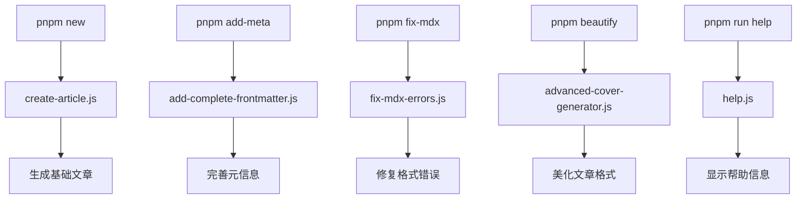
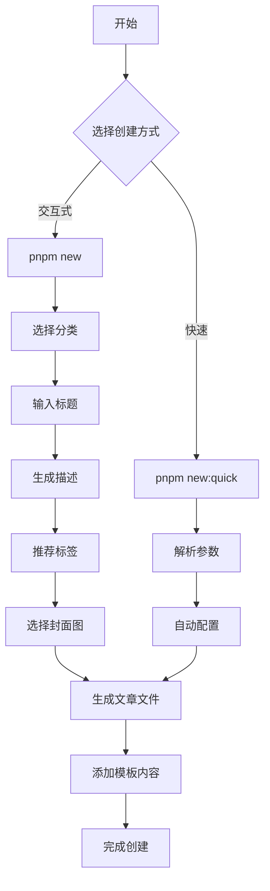
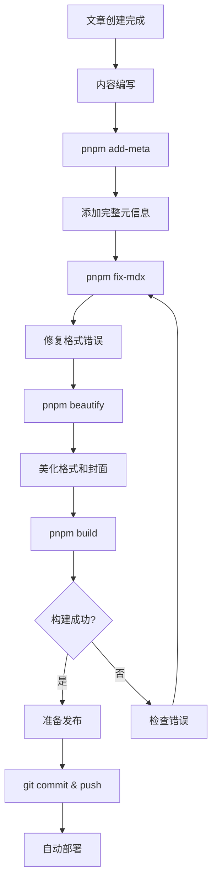

# 📁 项目结构说明

## 🎯 概览

本文档详细说明了 agentbangbang's Blog 项目的目录结构和文件组织方式。

## 📂 根目录结构

```
blog/
├── 📝 blog/                    # 博客文章目录
│   ├── develop/                # 开发技术类文章
│   ├── program/                # 编程实践类文章
│   ├── project/                # 项目分享类文章
│   ├── lifestyle/              # 生活感悟类文章
│   ├── reference/              # 年度总结类文章
│   └── authors.yml             # 作者信息配置
├── 📚 docs/                    # 文档目录
│   ├── ARTICLE_WORKFLOW_COMPLETE.md  # 完整工作流程文档
│   ├── QUICK_REFERENCE.md      # 快速参考指南
│   └── PROJECT_STRUCTURE.md    # 项目结构说明
├── 🛠️ scripts/                # 自动化脚本
│   ├── create-article.js       # 文章创建脚本
│   ├── add-complete-frontmatter.js  # 元信息添加脚本
│   ├── fix-mdx-errors.js       # MDX错误修复脚本
│   ├── advanced-cover-generator.js  # 高级封面生成脚本
│   └── help.js                 # 帮助命令脚本
├── 🎨 src/                     # 源代码目录
│   ├── components/             # React 组件
│   ├── pages/                  # 页面组件
│   ├── css/                    # 样式文件
│   └── theme/                  # 主题定制
├── 🌍 i18n/                    # 国际化文件
│   ├── zh/                     # 中文翻译
│   └── en/                     # 英文翻译
├── 📊 data/                    # 数据配置
│   ├── features.tsx            # 特性数据
│   ├── projects.tsx            # 项目数据
│   ├── skills.tsx              # 技能数据
│   └── social.ts               # 社交链接
├── 🖼️ static/                  # 静态资源
│   ├── img/                    # 图片资源
│   └── manifest.json           # PWA 配置
├── ⚙️ 配置文件
│   ├── docusaurus.config.ts    # Docusaurus 主配置
│   ├── package.json            # 项目依赖和脚本
│   ├── tsconfig.json           # TypeScript 配置
│   ├── tailwind.config.ts      # Tailwind CSS 配置
│   └── vercel.json             # Vercel 部署配置
└── 📄 文档文件
    ├── README.md               # 项目说明
    └── LICENSE                 # 开源协议
```

## 📝 博客文章结构

### 文章分类说明

```
blog/
├── develop/                    # 开发技术
│   ├── React Hooks 最佳实践.md
│   ├── TypeScript 进阶指南.md
│   └── Docker 容器化实践.md
├── program/                    # 编程实践
│   ├── 微服务架构设计.md
│   ├── API 设计最佳实践.md
│   └── 数据库优化技巧.md
├── project/                    # 项目分享
│   ├── 个人博客搭建指南.md
│   ├── 开源项目维护心得.md
│   └── 产品设计思考.md
├── lifestyle/                  # 生活感悟
│   ├── 程序员的时间管理.md
│   ├── 职场沟通技巧.md
│   └── 学习方法分享.md
└── reference/                  # 年度总结
    ├── 2024年度总结.md
    ├── 技术成长回顾.md
    └── 未来规划思考.md
```

### 文章文件格式

每篇文章都包含完整的 frontmatter：

```markdown
---
slug: article-url-slug          # URL 路径
title: 文章标题                 # 显示标题
date: 2024-01-15               # 发布日期
authors: default               # 作者信息
tags: [标签1, 标签2, 标签3]     # 文章标签
keywords: [关键词1, 关键词2]    # SEO 关键词
description: 文章描述...        # 文章描述
image: 封面图URL               # 封面图片
---

文章内容...
```

## 🛠️ 脚本工具结构

### 核心脚本功能

```
scripts/
├── create-article.js           # 📝 文章创建
│   ├── 交互式创建流程
│   ├── 快速创建模式
│   ├── 智能标签推荐
│   └── 自动封面图选择
├── add-complete-frontmatter.js # 📋 元信息管理
│   ├── 自动生成 slug
│   ├── 智能描述生成
│   ├── 关键词提取
│   └── 标签推荐
├── fix-mdx-errors.js          # 🔧 错误修复
│   ├── 代码块格式修复
│   ├── HTML 注释清理
│   ├── Frontmatter 验证
│   └── 特殊字符处理
├── advanced-cover-generator.js # 🎨 封面图生成
│   ├── 多源图片支持
│   ├── 智能图片选择
│   ├── 动态 OG 图生成
│   └── 批量处理功能
└── help.js                    # 📚 帮助系统
    ├── 命令说明
    ├── 使用示例
    └── 故障排除
```

### 脚本调用关系



## 🎨 源代码结构

### 组件组织

```
src/
├── components/                 # 可复用组件
│   ├── landing/               # 首页组件
│   │   ├── Hero/              # 英雄区域
│   │   ├── FeaturesSection/   # 特性展示
│   │   └── ProjectSection/    # 项目展示
│   ├── magicui/               # UI 组件库
│   │   ├── bento-grid.tsx     # 网格布局
│   │   ├── particles.tsx      # 粒子效果
│   │   └── marquee.tsx        # 滚动文字
│   └── common/                # 通用组件
│       ├── SocialLinks/       # 社交链接
│       ├── UserCard/          # 用户卡片
│       └── Tooltip/           # 工具提示
├── pages/                     # 页面组件
│   ├── index.tsx              # 首页
│   ├── about.mdx              # 关于页面
│   ├── friends/               # 友链页面
│   └── project/               # 项目页面
├── theme/                     # 主题定制
│   ├── BlogLayout/            # 博客布局
│   ├── BlogPostItem/          # 文章列表项
│   ├── CodeBlock/             # 代码块
│   └── Navbar/                # 导航栏
└── css/                       # 样式文件
    ├── custom.css             # 自定义样式
    └── tweet-theme.css        # 推文主题
```

### 页面路由结构

```
路由映射:
/                              # 首页 (src/pages/index.tsx)
/about                         # 关于页面 (src/pages/about.mdx)
/blog                          # 博客列表 (自动生成)
/blog/[slug]                   # 文章详情 (自动生成)
/blog/tags                     # 标签列表 (自动生成)
/blog/tags/[tag]              # 标签文章 (自动生成)
/friends                       # 友链页面 (src/pages/friends/)
/project                       # 项目页面 (src/pages/project/)
```

## 📊 数据配置结构

### 配置文件说明

```
data/
├── features.tsx               # 🌟 网站特性
│   ├── 特性标题和描述
│   ├── 图标和链接
│   └── 展示顺序
├── projects.tsx               # 🚀 项目展示
│   ├── 项目信息
│   ├── 技术栈标签
│   ├── 预览图片
│   └── 源码链接
├── skills.tsx                 # 💪 技能展示
│   ├── 技能分类
│   ├── 熟练程度
│   └── 相关图标
└── social.ts                  # 🔗 社交链接
    ├── 平台链接
    ├── 联系方式
    └── 个人信息
```

## 🌍 国际化结构

### 多语言支持

```
i18n/
├── zh/                        # 中文 (默认)
│   ├── code.json              # 代码翻译
│   ├── docusaurus-plugin-content-blog/
│   │   └── options.json       # 博客插件翻译
│   ├── docusaurus-plugin-content-docs/
│   │   └── current.json       # 文档翻译
│   └── docusaurus-theme-classic/
│       ├── footer.json        # 页脚翻译
│       └── navbar.json        # 导航栏翻译
└── en/                        # 英文
    ├── code.json
    ├── docusaurus-plugin-content-blog/
    ├── docusaurus-plugin-content-docs/
    └── docusaurus-theme-classic/
```

## ⚙️ 配置文件说明

### 核心配置

| 文件 | 用途 | 主要配置项 |
|------|------|------------|
| `docusaurus.config.ts` | Docusaurus 主配置 | 站点信息、插件、主题 |
| `package.json` | 项目依赖和脚本 | 依赖包、自动化脚本 |
| `tsconfig.json` | TypeScript 配置 | 编译选项、路径映射 |
| `tailwind.config.ts` | Tailwind CSS 配置 | 样式主题、插件 |
| `vercel.json` | Vercel 部署配置 | 构建命令、重定向 |

### 脚本命令映射

| 命令 | 脚本文件 | 功能描述 |
|------|----------|----------|
| `pnpm new` | `create-article.js` | 交互式创建文章 |
| `pnpm add-meta` | `add-complete-frontmatter.js` | 添加完整元信息 |
| `pnpm fix-mdx` | `fix-mdx-errors.js` | 修复 MDX 错误 |
| `pnpm beautify` | `advanced-cover-generator.js` | 美化文章格式 |
| `pnpm run help` | `help.js` | 显示帮助信息 |

## 🔄 工作流程图

### 文章创建流程



### 文章优化流程



## 📈 扩展建议

### 新增功能时的目录规划

1. **新增组件**：放在 `src/components/` 下对应分类
2. **新增页面**：在 `src/pages/` 下创建
3. **新增脚本**：在 `scripts/` 下创建，并更新 `package.json`
4. **新增样式**：在 `src/css/` 下创建或修改
5. **新增数据**：在 `data/` 下创建配置文件

### 维护建议

- 定期清理无用文件
- 保持目录结构的一致性
- 及时更新文档说明
- 遵循命名规范

---

> 💡 **提示**：这个结构文档会随着项目的发展而更新，建议定期查看最新版本。 